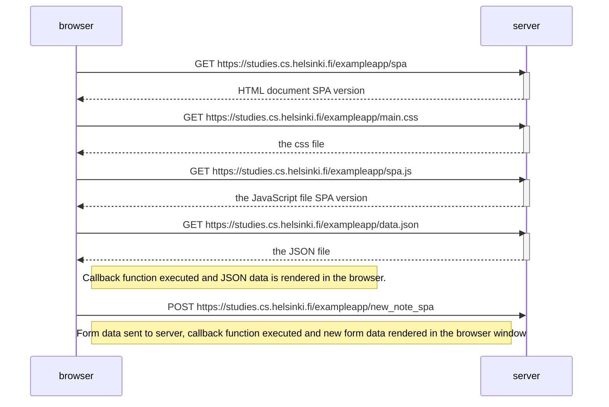

```mermaid
    sequenceDiagram
    participant browser
    participant server

    browser->>server: GET https://studies.cs.helsinki.fi/exampleapp/spa
    activate server
    server-->>browser: HTML document SPA version
    deactivate server

    browser->>server: GET https://studies.cs.helsinki.fi/exampleapp/main.css
    activate server
    server-->>browser: the css file
    deactivate server

    browser->>server: GET https://studies.cs.helsinki.fi/exampleapp/spa.js
    activate server
    server-->>browser: the JavaScript file SPA version
    deactivate server

    browser->>server: GET https://studies.cs.helsinki.fi/exampleapp/data.json
    activate server
    server-->>browser: the JSON file
    deactivate server

    Note right of browser: Callback function executed and JSON data is rendered in the browser.

    browser->>server: POST https://studies.cs.helsinki.fi/exampleapp/new_note_spa
    Note left of server: Form data sent to server, callback function executed and new form data rendered in the browser window


```
