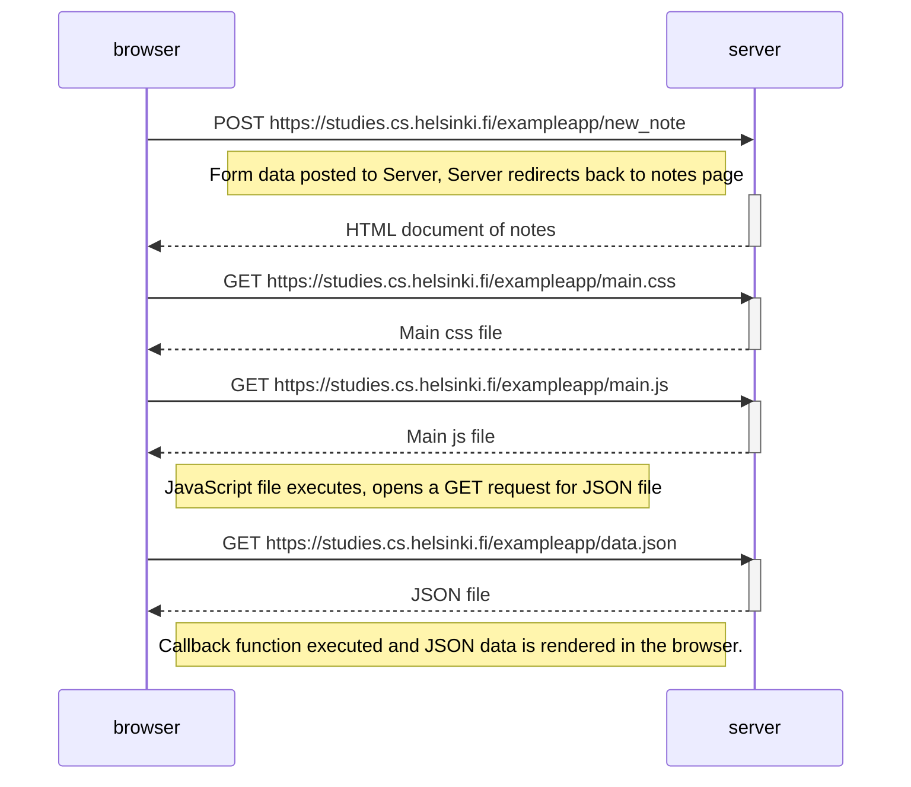

```mermaid
    sequenceDiagram
    participant browser
    participant server

    browser->>server: POST https://studies.cs.helsinki.fi/exampleapp/new_note
    Note left of server: Form data posted to Server, Server redirects back to notes page
    activate server
    server-->>browser: HTML document of notes
    deactivate server

    browser->>server: GET https://studies.cs.helsinki.fi/exampleapp/main.css
    activate server
    server-->>browser: Main css file
    deactivate server

    browser->>server: GET https://studies.cs.helsinki.fi/exampleapp/main.js
    activate server
    server-->>browser: Main js file
    deactivate server

    Note right of browser: JavaScript file executes, opens a GET request for JSON file

    browser->>server: GET https://studies.cs.helsinki.fi/exampleapp/data.json
    activate server
    server-->>browser: JSON file
    deactivate server

    Note right of browser: Callback function executed and JSON data is rendered in the browser.
```
